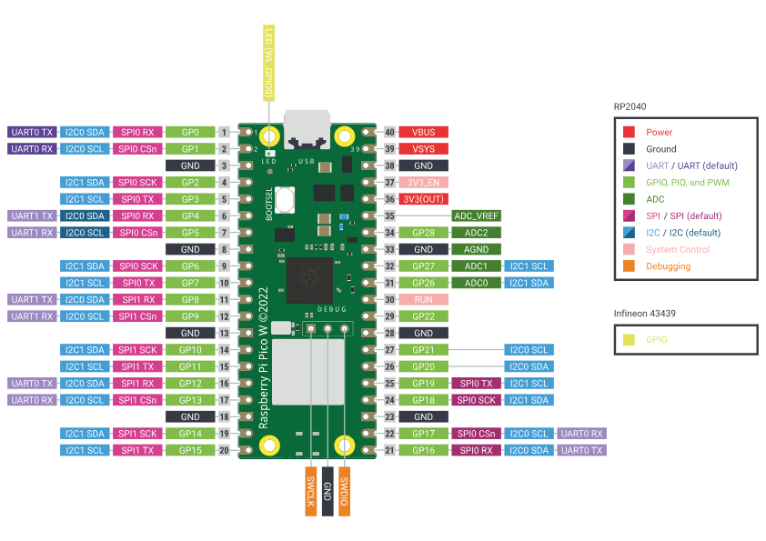

 Pico W Weather Station

A MicroPython-based weather station using Raspberry Pi Pico W with BMP280 sensor.

## Features

- **Captive Portal Setup** - Configure Wi-Fi via phone/browser
- **Static IP Support** - Choose your own IP address
- **Live Weather Data** - Temperature and pressure readings
- **Auto-refresh** - Updates every 5 seconds
- **Two-step Wi-Fi Verification** - Test connection before saving credentials
- **LED Status Indicator**
  - Blinking = AP/Setup mode
  - Solid ON = Connected and running

---

## Project Structure

```
src/
├── booty.py     # Entry point - Wi-Fi/AP management (rename to boot.py for production)
├── maing.py     # Weather station HTTP server (rename to main.py for production)
├── config.py    # All configuration settings
├── html.py      # Template loader and renderer
├── bmp280.py    # Sensor driver library
└── templates/
    ├── styles.css              # Shared CSS for all pages
    ├── setup.html              # Wi-Fi configuration form
    ├── connectingpage.html     # Connection testing page
    ├── connectconfirm.html     # Confirmation before saving
    ├── connectconfirmed.html   # Success page
    ├── weather.html            # Main weather dashboard
    └── logout.html             # Logout confirmation

tests/
├── ledtest.py           # LED blink test
├── check_chip_id.py     # Verify BMP280/BME280 sensor
├── bmp.py               # Sensor reading test
└── dev_preview.py       # HTML template preview server
```

---

## Development vs Production

### During Development (Current State)

Files are named `booty.py` and `maing.py` so you can:
- Run them manually in Thonny IDE
- Edit and test without auto-boot issues
- Quickly iterate on changes

If renamed to boot and main they would execute immediately upon plugging power.
We want this in final product however during development this causes us not be able to update files easily.

### For Production Deployment

Before final deployment, rename:
1. `booty.py` → `boot.py`
2. `maing.py` → `main.py`
3. Update references in booty.py and maing.py to boot and main.

This enables auto-boot when Pico W powers on (no Thonny needed).

---

## How It Works

```
Power On
    │
    ▼
booty.py (boot.py in production)
    │
    ├── credentials.json exists?
    │       │
    │       ├── YES → Connect to Wi-Fi → maing.py (weather station)
    │       │
    │       └── NO → Start AP mode → Setup portal (192.168.4.1)
    │
    ▼
User configures Wi-Fi via portal
    │
    ▼
Test connection → Show confirmation → User clicks "Confirm & Start"
    │
    ▼
Save credentials → maing.py (weather station)
```

### Setup Flow Details

1. **Setup Page** (`/`) - User enters SSID, password, and chooses IP address
2. **Connecting Page** (`/connecting`) - Shows "Connecting..." while testing (up to 15 seconds)
   - Server closes during test to avoid connection timeouts
   - JavaScript polls every 2 seconds to check when server is back
   - Automatically redirects when test completes
3. **Result**:
   - **Success** → Confirmation page with "Confirm & Start" button
   - **Failure** → Back to setup page with error message
4. **Confirmation Page** - User reviews connection details and confirms
5. **Weather Station** - Main application starts

---

## Prerequisites

### 1. Flash MicroPython on Pico W

Download firmware from: https://micropython.org/download/RPI_PICO_W/

### 2. Install Thonny IDE

- Go to **Tools → Options → Interpreter**
- Select: **MicroPython (Raspberry Pi Pico)**
- Choose port:
  - Linux: `/dev/ttyACM0`
  - Windows: `COM3` (or similar)

### 3. Test Connection

```python
print("Hello Pico W!")
```
Run this or `ledtest.py` from `/tests`

---

## Hardware Setup

### BMP280 Sensor Wiring

| Sensor Pin | Pico W Pin | Wire Color (example) |
|------------|------------|----------------------|
| VCC | 3V3 (Pin 36) | Red |
| GND | Any GND | Black |
| SCL | GP3 (Pin 5) | Blue |
| SDA | GP2 (Pin 4) | Green |



### Verify Sensor

Run `tests/check_chip_id.py`:
- `0x58` = BMP280 (temperature + pressure)
- `0x60` = BME280 (+ humidity)

Test readings with `tests/bmp.py` - should print temperature and pressure every second.

---

## Installation

### Upload to Pico W

1. Open Thonny → **View → Files**
2. Delete any existing files on Pico W
3. Select all files in `src/` folder (including `templates/` subfolder)
4. Right-click → **Upload to /**
5. Verify all files are present on the Pico W

### Run the Application

In Thonny:
1. Open `booty.py`
2. Click **Run**
3. Watch the console output for status messages

---

## Configuration

Edit `config.py` to customize:

```python
# Access Point settings
AP_SSID = 'PicoW-Weatherstation'
AP_PASSWORD = ''  # Empty = open network

# Static IP settings
USE_STATIC_IP = True
STATIC_IP = '192.168.1.100'
SUBNET_MASK = '255.255.255.0'
GATEWAY = '192.168.1.1'
DNS = '8.8.8.8'

# Web server settings
REFRESH_INTERVAL = 5  # Seconds between page refreshes (in weather app)

# Sensor thresholds for status colors
TEMP_HIGH = 25.0   # Red above this (°C)
TEMP_LOW = 18.0    # Blue below this (°C)
PRESSURE_LOW = 1000    # Orange below this (hPa)
PRESSURE_HIGH = 1020   # Purple above this (hPa)
```

---

## Development Tools

### HTML Template Preview

Preview and edit HTML templates in your browser without uploading to Pico W:

```bash
cd tests
python3 dev_preview.py
```

Then open: http://localhost:8080

**Available pages:**
- http://localhost:8080/setup.html
- http://localhost:8080/connectingpage.html
- http://localhost:8080/connectconfirm.html
- http://localhost:8080/connectconfirmed.html
- http://localhost:8080/weather.html
- http://localhost:8080/logout.html

**Features:**
- CSS reloads on every request - just refresh browser to see changes
- All template variables are filled with sample data
- Works with any browser - no Pico W needed
- Perfect for rapid UI development and testing

**Usage Tips:**
1. Edit `src/templates/styles.css` or any `.html` file
2. Refresh browser to see changes instantly
3. Once satisfied, upload updated files to Pico W

---
